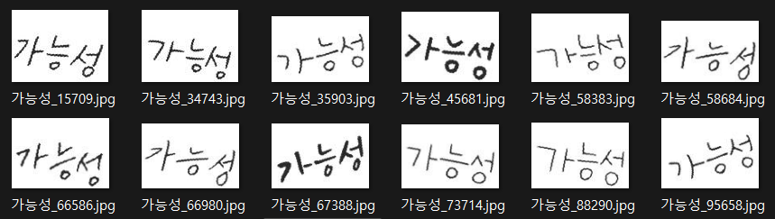

# 📝손글씨 인식 모델 성능 개선 - EasyOCR Fine-tuning

## 개요
- 프로젝트 이름: 손글씨 인식 모델 성능 개선
- 프로젝트 지속기간: 2024.06.13~2024.06.19
- 개발 언어: Python
- 멤버: 김가영,음정우,이도형,임승빈

## 소개
- EasyOCR fine-tuning을 통해 손글씨 인식 성능을 개선
- 본 프로젝트는 학습의 각 단계별로 다음과 같은 오픈소스 기반 프로젝트를 이용
  - 학습데이터 생성: [TextRecognitionDataGenerator](https://github.com/Belval/TextRecognitionDataGenerator)
  - 학습데이터 변환: [TRDG2DTRB](https://github.com/DaveLogs/TRDG2DTRB)
  - 모델 학습 및 배포: [Deep-Text-Recognition-Benchmark](https://github.com/clovaai/deep-text-recognition-benchmark)
  - 사용자 학습 모델 사용: [EasyOCR](https://github.com/JaidedAI/EasyOCR)

## Step 1: 데이터 준비
  ```
  workspace
  ├── step1 # 한글 학습 데이터 생성
  │   ├── train
  │   └──  validation
  ├── step2 # 학습 데이터 변환
  │   ├── train
  │   │   ├── gt.txt
  │   │   └── images
  │   │       ├── image_000000.jpg
  │   │       ├── image_000001.jpg
  │   │       └── ...
  │   └──  validation
  └── step3 # lmdb 포맷으로 변한
      ├── train
      │   ├── data.mdb
      │   └── lock.mdb
      └── validation
          ├── data.mdb
          └── lock.mdb
  ```
### 1-1. 한글 학습 데이터 생성
| No | Arguments | Description | Custom |
| --- | --- | --- | --- |
| 1 | -i, --input_file | 기본으로 제공되는 학습 단어 모음(dictionaries)이 아닌, 직접 구축한 학습 단어 모음을 사용하고 싶을 때 사용 | 기본 한글 dic 수정 → 숫자+영문+한국어 5,888 기초 낱말(국립국어연구원 발표)+외래어 사전 조합 8,347개 |
| 2 | --output_dir | 생성데이터를 저장하는 위치를 지정할 수 있으며, 기본값은 '/out' 디렉토리 |  |
| 3 | -c, --count | 생성할 학습 데이터의 개수로, 기본값은 1,000 | train 100000 / validation 1000 |
| 4 | -l, --language | 학습데이터의 언어를 변경하고자 할 때 사용 | -l ko |
| 5 | -t, --thread_count | 학습데이터 생성 시 사용할 CPU 코어의 개수 | None |
| 6 | -f, --format | 생성되는 이미지 사이즈로, 기본값은 32 pixel | -f 80 -or 0 Height pixel을 80으로 변경 |
| 7 | -ft, --font | 생성할 학습데이터에 사용할 특정 폰트파일 지정 시 사용 | default 글씨체를 삭제하고 [네이버 나눔 손글씨 글꼴](https://clova.ai/handwriting/list.html) 50개 추가 |
| 8 | -b,  --background | 사용할 배경의 종류를 정의 0→ Gaussian Noise; 1→ Plain white; 2→ Quasicrystal; 3→ Pictures | -b 1 Plain White로 설정 |
| 9 | -m, --margins | 렌더링할 때 텍스트 주위의 여백을 정의 | -m 0,0,0,0  여백을 없애서 붙어있는 단어의 경우 더 잘 인식될 수 있도록 설정 |
| 10 | -k, --skew_angle | 생성된 텍스트의 기울기 각도를 정의 | -k 15 -rk  -15에서 15도 사이에서 삐뚤어지게 생성하여 손글씨체 형태 반영  |



### 1-2. 학습 데이터 변환
이미지 파일 목록과 각 이미지 파일의 label이 저장된 gt.txt 파일로 변환

### 1-3. 학습데이터를 lmdb 포맷으로 변환
실제 학습에서 사용할 lmdb 포맷으로 학습데이터를 변환

## Step 2: 모델 학습 
- **Pre-Trained Model**: EasyOCR Model Hub 'korean_g2.pth'
- **Data processing**
    | No | Arguments | Default | Custom |
    | --- | --- | --- | --- |
    | 1 | --select_data | MJ-ST | / |
    | 2 | --batch_ratio | 0.5-0.5 | 1 |
    | 3 | --imgH | 32 | 80 |
    | 4 | --imgW | 100 | 100 |
    | 5 | --character | 0123456789abcdefghijklmnopqrstuvwxyz | 'korean_g2' > 'characters' 사용 |
- **Model Architecture**
 
    학습모델의 모듈 조합: **'None-VGG-BiLSTM-CTC'**
    
    | No | Arguments | Default | Custom |
    | --- | --- | --- | --- |
    | 1 | --Transformation | None/TPS | None |
    | 2 | --FeatureExtraction | VGG/RCNN/ResNet | VGG |
    | 3 | --SequenceModeling | None/BiLSTM | BiLSTM |
    | 4 | --Prediction | CTC/Attn | CTC |
    | 5 | --input_channel | 1 | 1 |
    | 6 | --output_channel | 512 | 256 |
    | 7 | --hidden_size | 256 | 256 |
- **Sample of training log** ('log_train.txt')
  ```
  [1/300000] Train loss: 2.50540, Valid loss: 1.29134, Elapsed_time: 68.71375
    Current_accuracy : 68.800, Current_norm_ED  : 0.84
    Best_accuracy    : 68.800, Best_norm_ED     : 0.84
    --------------------------------------------------------------------------------
    Ground Truth              | Prediction                | Confidence Score & T/F
    --------------------------------------------------------------------------------
    한번                        | 한번                        | 0.9966	True
    재산                        | 재산                        | 0.9996	True
    불러일으키다                    | 불임으다                      | 0.3046	False
    논하다                       | 논하다                       | 0.9999	True
    키                         | 구                         | 0.8717	False
    --------------------------------------------------------------------------------
    [2000/300000] Train loss: 0.06096, Valid loss: 0.02102, Elapsed_time: 404.18034
    Current_accuracy : 98.200, Current_norm_ED  : 0.99
    Best_accuracy    : 98.200, Best_norm_ED     : 0.99
    --------------------------------------------------------------------------------
    Ground Truth              | Prediction                | Confidence Score & T/F
    --------------------------------------------------------------------------------
    뛰어나오다                     | 뛰어나오다                     | 0.8866	True
    큰딸                        | 큰딸                        | 0.9513	True
    재산                        | 재산                        | 0.9996	True
    리트머스                      | 리트머스                      | 0.7872	True
    신디이트                      | 신디이트                      | 0.9853	True
    --------------------------------------------------------------------------------
    [4000/300000] Train loss: 0.00165, Valid loss: 0.01216, Elapsed_time: 708.81233
    Current_accuracy : 99.100, Current_norm_ED  : 0.99
    Best_accuracy    : 99.100, Best_norm_ED     : 0.99
    --------------------------------------------------------------------------------
    Ground Truth              | Prediction                | Confidence Score & T/F
    --------------------------------------------------------------------------------
    등장하다                      | 등장하다                      | 0.6699	True
    3                         | 3                         | 0.9937	True
    단어                        | 단어                        | 0.9970	True
    나빠지다                      | 나빠지다                      | 0.9986	True
    팩시밀리                      | 팩시밀리                      | 0.9970	True
    --------------------------------------------------------------------------------
    [6000/300000] Train loss: 0.00042, Valid loss: 0.01090, Elapsed_time: 1013.74369
    Current_accuracy : 98.900, Current_norm_ED  : 0.99
    Best_accuracy    : 99.100, Best_norm_ED     : 0.99
    --------------------------------------------------------------------------------
    Ground Truth              | Prediction                | Confidence Score & T/F
    --------------------------------------------------------------------------------
    그리로                       | 그리로                       | 0.8917	True
    예비                        | 예비                        | 1.0000	True
    리보솜                       | 리보솜                       | 0.9967	True
    불안하다                      | 불안하다                      | 0.9940	True
    말하다                       | 말하다                       | 0.9957	True
    --------------------------------------------------------------------------------
  ```

## Step 3: 사용자 모델 적용 및 테스트
  ```
  workspace
  ├── NVBC
  │   ├── __pycache__
  │   │   └── custom.cpython-310.pyc
  │   ├── craft_mlt_25k.pth
  │   ├── custom.pth  # 사용자 모델
  │   ├── custom.py   # 파라미터 정보
  │   └── custom.yaml # 네트워크 구조
  ├── demo_images     # test image
  │   ├── a1.webp
  │   ├── a2.jpg
  │   └── ...
  └── pre_trained_model # pre-trained 모델
      └── korean_g2.pth
  ```
 [EasyOCR](https://github.com/JaidedAI/EasyOCR) 프로젝트 root에서 run `NVBC_run.py`
  
### 테스트 결과
**Test Image - 손글씨**

**사용자 모델**
```
filename: 'test_1.png', confidence: 0.6294, string: '짐'
filename: 'test_2.png', confidence: 0.9004, string: '가고싶다'
filename: 'test_3.png', confidence: 1.0000, string: '여러분'
filename: 'test_4.png', confidence: 0.9997, string: '행복하세요'
filename: 'test_5.png', confidence: 0.7900, string: '취업 준비생입니다 글씨에 성격이담긴다지만 저논'
filename: 'test_5.png', confidence: 0.7311, string: '이상을 담으려 해요 불투명한 미래에도 희망이'
filename: 'test_5.png', confidence: 0.5547, string: '있다논 믿음을 가지려합니다'
```
**Easy OCR**
```
filename: 'test_1.png', confidence: 0.8322, string: '진'
filename: 'test_2.png', confidence: 0.9979, string: '가고싶다'
filename: 'test_3.png', confidence: 0.9997, string: '여러분'
filename: 'test_4.png', confidence: 0.6387, string: '행복하세요'
filename: 'test_4.png', confidence: 0.2959, string: '취업 준비생입나다: 글씨에 성격이| 담긴다지만 저논'
filename: 'test_4.png', confidence: 0.4741, string: '이상을 담으려 해요 불투명한 미래에도 희망이'
filename: 'test_4.png', confidence: 0.5706, string: '있다는 믿음올 가지려 합나다:'
```

**Test Image - 표지판**

**사용자 모델**
```
filename: 'a1.webp', confidence: 0.3008, string: '5'
filename: 'a1.webp', confidence: 0.5112, string: '사 상'
filename: 'a1.webp', confidence: 0.6634, string: '하단 Hadan'
filename: 'a1.webp', confidence: 0.9990, string: '30'
filename: 'a1.webp', confidence: 0.6714, string: '사상 Sasang'
filename: 'a1.webp', confidence: 0.4733, string: 'l50m'
filename: 'a2.jpg', confidence: 0.7917, string: '외부차랑'
filename: 'a2.jpg', confidence: 0.9971, string: '주차금지'
filename: 'a2.jpg', confidence: 0.5975, string: '주정차 적발 시 견인 조치'
filename: 'a2.jpg', confidence: 0.5594, string: '차량 파손 시 책임지지 않습니다'
```
**Easy OCR**
```
filename: 'a1.webp', confidence: 1.0000, string: '5'
filename: 'a1.webp', confidence: 0.9600, string: '사 상'
filename: 'a1.webp', confidence: 0.0013, string: '하단 }누|하7'
filename: 'a1.webp', confidence: 0.8952, string: '30'
filename: 'a1.webp', confidence: 0.0006, string: '사상 -멋5히굽9'
filename: 'a1.webp', confidence: 0.3478, string: '150,'
filename: 'a2.jpg', confidence: 0.9911, string: '외부차량'
filename: 'a2.jpg', confidence: 0.9992, string: '주차금지'
filename: 'a2.jpg', confidence: 0.7833, string: '주 정차 적발 시 견인 조치'
filename: 'a2.jpg', confidence: 0.6502, string: '차량 파손 시 책임지지 않습니다'
```

## References
- [EasyOCR](https://github.com/JaidedAI/EasyOCR)
- [What Is Wrong With Scene Text Recognition Model Comparisons? Dataset and Model Analysis](https://github.com/clovaai/deep-text-recognition-benchmark/blob/master/train.py)
 - [EasyOCR 사용자 모델 학습하기](https://davelogs.tistory.com/76)

## 산출물 파일 링크

  - [모델링 기법 설정](reports/report1.md) 
  - [테스트 설계 보고서](reports/report2.md)
  - [프로세스 검토 결과 보고서](reports/report3.md)
  - [EasyOCR이란?](reports/EasyOCR.md)