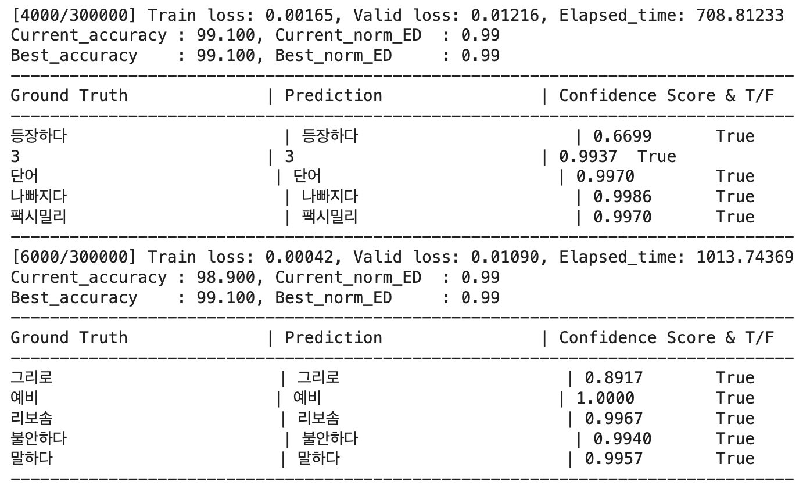

# 테스트 설계 보고서

1. **모델 평가 기준**
    
     모델을 학습시키면서 에폭이 2000번 실행될때마다 train loss, valid loss, 걸린시간,current_accuracy, current_norm_ED, Best_accuracy, Best_norm_ED를 측정하고 
    
    각 데이터마다 예측한 값과 신뢰도, 정답을 맞춘지 알려주는 T/F 를 통해 잘 학습되고있는지 확인해준다. 
    
2. **테스트 환경**
    
    모델 학습시에는 colab의 GPU를 사용해 진행하였고,  
    추론은 걸리는 시간이 적어서 로컬의 CPU에서 진행하였다.
    
3. **테스트 결과**
    
    
    
    **성능 :** 모델을 학습시켰을때 화면은 다음과 같다. 에폭이 2000번 돌아갈때마다 현재 성능이 출력되는데 끝까지 학습시키지는 않고 정확도가 99%이상이면 출력을 멈춰준다. 
    
    **처리 속도** : 목표한 정확도까지 걸리는 시간은 대략 30분 안쪽이다. 추론의 경우 정확한 측정은 이루어지지 않았지만 이미지 하나를 추론한다면 10초안쪽으로 소요된다.