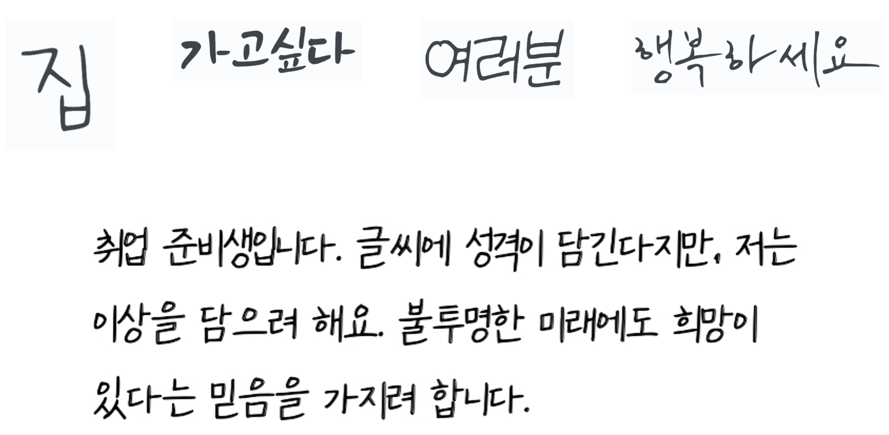
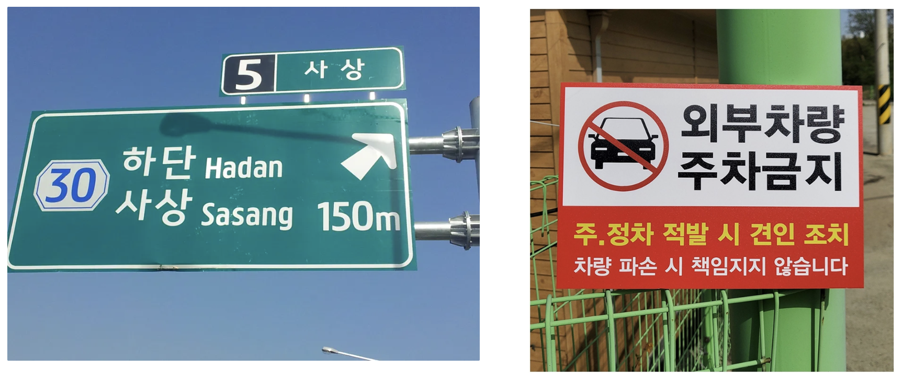

# 프로세스 검토 결과 보고서

1. **프로젝트 진행 프로세스 설명**
    - 프로젝트 흐름도 및 단계 별 설명
        - 한글 학습데이터 생성 및 변환작업
            1. 이미지 파일 목록과 각 이미지 파일의 label이 저장된 gt.txt 파일로 변환하여 실제 학습에서 사용할  lmdb 포맷으로 학습데이터를 변환한다
        - Pre-Trained Model 준비 및 모델학습
            1. 미세조정(Fine-tune) 학습을 위해 기초가 되는 학습 모델을 [EasyOCR](https://github.com/JaidedAI/EasyOCR) Model Hub에서 다운로드(한글 데이터 학습을 위해 **'korean_g2' 모델**을 다운로드)
            2. 데이터셋을 Train 100,000 / Validation 1,000 
            3. Batch size: 192,  Optimizer: Adam, Loss  function: CTCLoss, lr: 1
            4. [deep-text-recognition-benchmark](https://github.com/clovaai/deep-text-recognition-benchmark) 프로젝트 root에서 학습
        - 사용자 모델 적용 및 테스트
            1. 학습 시 정확도가 가장 높은 모델을  custom.pth를 저장
            2. 학습 시 필요한 파라미터를  custom.yaml파일에 저장
            3. 사용자 모델의 네트워크 구조를 정의하는 모듈 [custom.py](http://custom.py) 생성
            4. 학습한 사용자 모델과 구성한 사용 환경을 바탕으로 [EasyOCR](https://github.com/JaidedAI/EasyOCR) 프로젝트 root에서 테스트 (NVBC_run.py 실행하여 테스트)
    - 각 단계에 참여자
        - 각 단계에 각자 테스트하고 내용 공유및 에러처리하는 방식으로 진행함
    - 각 단계에서 사용된 도구 및 시스템
        - 한글 데이터 생성: TextRecognitionDataGenerator
        - 이미지 라벨 변환작업: TRDG2DTRB
        - lmdb 변환 및 모델 학습: deep-text-recognition-benchmark
        - 사용자 모델 테스트: easyOCR
  
2. **각 프로세스 결과 분석**
    **Test Image - 손글씨**

**사용자 모델**
```
filename: 'test_1.png', confidence: 0.6294, string: '짐'
filename: 'test_2.png', confidence: 0.9004, string: '가고싶다'
filename: 'test_3.png', confidence: 1.0000, string: '여러분'
filename: 'test_4.png', confidence: 0.9997, string: '행복하세요'
filename: 'test_5.png', confidence: 0.7900, string: '취업 준비생입니다 글씨에 성격이담긴다지만 저논'
filename: 'test_5.png', confidence: 0.7311, string: '이상을 담으려 해요 불투명한 미래에도 희망이'
filename: 'test_5.png', confidence: 0.5547, string: '있다논 믿음을 가지려합니다'
```
**Easy OCR**
```
filename: 'test_1.png', confidence: 0.8322, string: '진'
filename: 'test_2.png', confidence: 0.9979, string: '가고싶다'
filename: 'test_3.png', confidence: 0.9997, string: '여러분'
filename: 'test_4.png', confidence: 0.6387, string: '행복하세요'
filename: 'test_4.png', confidence: 0.2959, string: '취업 준비생입나다: 글씨에 성격이| 담긴다지만 저논'
filename: 'test_4.png', confidence: 0.4741, string: '이상을 담으려 해요 불투명한 미래에도 희망이'
filename: 'test_4.png', confidence: 0.5706, string: '있다는 믿음올 가지려 합나다:'
```

**Test Image - 표지판**

**사용자 모델**
```
filename: 'a1.webp', confidence: 0.3008, string: '5'
filename: 'a1.webp', confidence: 0.5112, string: '사 상'
filename: 'a1.webp', confidence: 0.6634, string: '하단 Hadan'
filename: 'a1.webp', confidence: 0.9990, string: '30'
filename: 'a1.webp', confidence: 0.6714, string: '사상 Sasang'
filename: 'a1.webp', confidence: 0.4733, string: 'l50m'
filename: 'a2.jpg', confidence: 0.7917, string: '외부차랑'
filename: 'a2.jpg', confidence: 0.9971, string: '주차금지'
filename: 'a2.jpg', confidence: 0.5975, string: '주정차 적발 시 견인 조치'
filename: 'a2.jpg', confidence: 0.5594, string: '차량 파손 시 책임지지 않습니다'
```
**Easy OCR**
```
filename: 'a1.webp', confidence: 1.0000, string: '5'
filename: 'a1.webp', confidence: 0.9600, string: '사 상'
filename: 'a1.webp', confidence: 0.0013, string: '하단 }누|하7'
filename: 'a1.webp', confidence: 0.8952, string: '30'
filename: 'a1.webp', confidence: 0.0006, string: '사상 -멋5히굽9'
filename: 'a1.webp', confidence: 0.3478, string: '150,'
filename: 'a2.jpg', confidence: 0.9911, string: '외부차량'
filename: 'a2.jpg', confidence: 0.9992, string: '주차금지'
filename: 'a2.jpg', confidence: 0.7833, string: '주 정차 적발 시 견인 조치'
filename: 'a2.jpg', confidence: 0.6502, string: '차량 파손 시 책임지지 않습니다'
```
### 모델 개선 노력

- **한글 손글씨 학습 데이터 생성**
    - 기존 한 글자 단위 → 단어 단위
    - 단일 폰트 → 여러 폰트
    - 기울기 각도 변경 etc ..
- **학습 설정 변경**
    - 최적화 함수
    - 데이터 처리
- **네트워크 구조 변경 - NVBC**
    - Transforamtion: None, TPS
    - Feature Extraction: VGG, RCNN, ResNet
    - Sequence Modeling: None, BiLSTM
    - Prediction: CTC, Attn
- 문제점
    - 모든 글자를 완벽히 표현하지 못하고 있고 띄어쓰기공백이 크면 개행되기도 함.
    - Prediction 옵션 중 Attention 추가하여 테스트하는 중에 트레이닝은 잘 되었으나 easyOCR 테스트 중 시간이 부족하였음.
- 개선점
    - 양질의 학습 데이터를 확보해야 함
    - 다양한 네트워크 구조를 시도해보고 최적의 옵션을 찾아야 함.